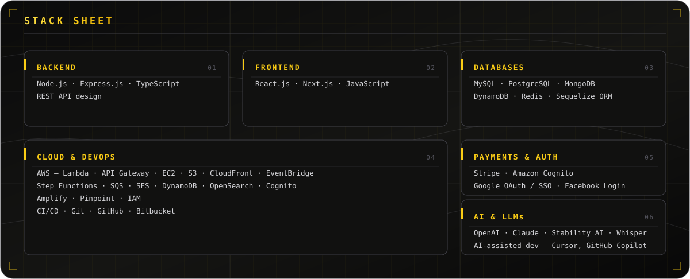

  
  &nbsp;·&nbsp;
  

`SYSTEM MODULES`

  

`BUILD LOG`

<table>
  <tr>
    <td width="52%" valign="top">
      <h3> Selftold</h3>
      
<strong>AI-powered storytelling platform</strong>

      
End-to-end ownership from architecture through production for a US launch. Stability AI image generation, Whisper transcription, Stripe subscriptions with reconciliation guardrails, and Cognito + SSO auth — live with 30–40 beta customers. Cut LCP by 60%+ through targeted Next.js rendering optimizations.

    </td>
    <td width="48%" valign="top">
      <h3> QUI Card</h3>
      
<strong>Digital identity & security platform</strong>

      
Backend services from design to production, serving 1,000+ users. RESTful APIs on Node.js/Express/Sequelize, Redis caching for hot identity data, and secure data modeling with field-level encryption and audit logging across MySQL and DynamoDB.

    </td>
  </tr>
</table>
